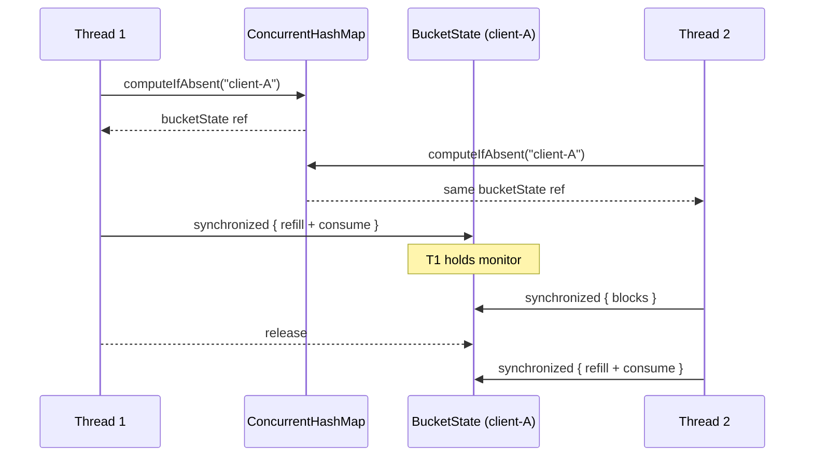

## Context

Greenfield library on the `rate-limiter` branch. No existing code to integrate with. The library must be thread-safe, strategy-pluggable, and testable without real time dependencies.

## Goals / Non-Goals

**Goals:**
- Clean separation between public API (`RateLimiter`) and strategy implementations
- Each strategy uses the concurrency mechanism most natural to its state shape
- Deterministic testing via injectable time source
- Per-client isolation with no cross-client contention

**Non-Goals:**
- Distributed or persistent rate limiting
- Runtime strategy switching
- Client entry eviction or memory management

## Decisions

### 1. `RateLimiter` as concrete class delegating to `Strategy` interface

`RateLimiter` is the public API surface. It holds a `Strategy` and forwards `tryAcquire(String clientId)`. The caller constructs it with a strategy:

```java
RateLimiter limiter = new RateLimiter(new TokenBucketStrategy(capacity, refillRate, clock));
limiter.tryAcquire("client-1");
```

**Why not make `RateLimiter` an interface?** A concrete class gives a single public entry point. Strategies are internal — callers don't need to know or depend on them. The class also provides a natural place for cross-cutting concerns later (metrics, eviction) without touching strategies.

### 2. `Result` record as return type

```java
record Result(boolean allowed, int remainingTokens, Duration retryAfter, int limit)
```

- `allowed`: whether the request was permitted
- `remainingTokens`: tokens/requests remaining after this call
- `retryAfter`: time until next token or window reset (`Duration.ZERO` when allowed)
- `limit`: the configured max capacity

**Why not boolean?** Callers often need to communicate back-pressure (remaining tokens) or retry timing to their own callers. A record is zero-cost boilerplate in Java 25+ and makes the API self-documenting.

### 3. `Clock` as a functional interface

```java
@FunctionalInterface
interface Clock {
    long nanoTime();
}
```

Production: `System::nanoTime`. Tests: a controllable lambda or `AtomicLong::get`.

**Why nanos, not `java.time.Clock`?** We're doing elapsed-time arithmetic (deltas), not wall-clock formatting. `nanoTime()` is monotonic and avoids the overhead and semantics of `Instant`.

### 4. `ConcurrentHashMap` per strategy, not shared

Each strategy owns its own `ConcurrentHashMap<String, StateType>`. The map type differs per strategy (`AtomicLong` for fixed window, a mutable state object for token bucket), so sharing isn't practical.

### 5. Token Bucket: `synchronized` on per-client state object

Token bucket `tryAcquire` is a compound operation: refill tokens based on elapsed time, then consume one. This touches two fields (`tokens` and `lastRefillNanos`) that must update atomically.



**Why not CAS with `AtomicReference<Record>`?** CAS would require allocating a new immutable state record on every attempt (including retries under contention). `synchronized` on the state object is simpler, allocation-free, and the critical section is nanoseconds of arithmetic — too fast for contention to matter in practice.

### 6. Fixed Window: `AtomicLong` with CAS and bit-packed state

Fixed window state is two integers: window ID and counter. These pack into a single `long`:

```
┌──────────────────────────────────────────────────────┐
│                   AtomicLong (64 bits)                │
├────────────────────────┬─────────────────────────────┤
│  upper 32: windowId    │  lower 32: counter          │
│  (nanoTime / duration) │  (requests in this window)  │
└────────────────────────┴─────────────────────────────┘
```

CAS loop: read state → check window → increment or reset → CAS. Failed CAS means another thread modified the state; retry with fresh read.

**Why not `synchronized` like token bucket?** The state fits in a single atomic word. CAS is lock-free, zero-allocation, and naturally efficient here. No reason to add a lock when the hardware gives us atomicity for free.

### 7. Package structure

```
io.github.elnurvl.limiter
├── RateLimiter.java            ← public API
├── Strategy.java               ← strategy interface
├── Result.java                 ← result record
├── Clock.java                  ← time abstraction
├── TokenBucketStrategy.java    ← token bucket implementation
└── FixedWindowStrategy.java    ← fixed window implementation
```

Flat package. No sub-packages — the library is small enough that nesting adds noise.

## Risks / Trade-offs

**[Unbounded map growth]** → `ConcurrentHashMap` grows with unique client IDs and never shrinks. For long-running services with many transient clients, this is a memory leak. Mitigation: documented as out of scope. A future eviction strategy could be added without changing the public API.

**[Fixed window boundary bursts]** → A client can send up to 2× the limit across a window boundary. This is inherent to the fixed window algorithm. Mitigation: documented behavior. Callers who need smoothing should use token bucket.

**[`nanoTime` is not wall-clock]** → `System.nanoTime()` is relative to an arbitrary origin and not meaningful across JVM restarts. This is fine for an in-memory library but means rate limiter state is not serializable. Mitigation: persistence is explicitly out of scope.

**[Bin-level contention in ConcurrentHashMap]** → For fixed window, different client IDs that hash to the same CHM bin could contend during `computeIfAbsent`. In practice, CHM's default concurrency level makes this rare. Mitigation: none needed; monitor in production if throughput is critical.
